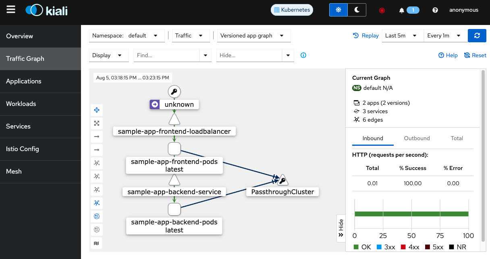

# Istio Service Mesh with Kubernetes Microservices

## install kindcluster setup

```
vagrant@cloud-native-box:~/k8s-cop/1-single-cluster/setup$ ls
metallb-native.yaml  setup-cilium-kindcluster12317.sh  setup-kindcluster-v2-script.sh  setup-kindcluster123.sh  setup-kindcluster124.sh  setup-kindcluster125.sh  setup-kindcluster127.sh  teardown.sh
vagrant@cloud-native-box:~/k8s-cop/1-single-cluster/setup$ ./setup-kindcluster123.sh 
fs.inotify.max_user_watches = 524288
fs.inotify.max_user_instances = 512
Creating cluster "123" ...
 ✓ Ensuring node image (kindest/node:v1.23.17) 🖼 
 ✓ Preparing nodes 📦 📦 📦 📦  
 ✓ Writing configuration 📜 
 ✓ Starting control-plane 🕹️ 
 ✓ Installing CNI 🔌 
 ✓ Installing StorageClass 💾 
 ✓ Joining worker nodes 🚜 
Set kubectl context to "kind-123"
You can now use your cluster with:

kubectl cluster-info --context kind-123

Thanks for using kind! 😊
namespace/metallb-system created
customresourcedefinition.apiextensions.k8s.io/addresspools.metallb.io created
customresourcedefinition.apiextensions.k8s.io/bfdprofiles.metallb.io created
customresourcedefinition.apiextensions.k8s.io/bgpadvertisements.metallb.io created
customresourcedefinition.apiextensions.k8s.io/bgppeers.metallb.io created
customresourcedefinition.apiextensions.k8s.io/communities.metallb.io created
customresourcedefinition.apiextensions.k8s.io/ipaddresspools.metallb.io created
customresourcedefinition.apiextensions.k8s.io/l2advertisements.metallb.io created
serviceaccount/controller created
serviceaccount/speaker created
role.rbac.authorization.k8s.io/controller created
role.rbac.authorization.k8s.io/pod-lister created
clusterrole.rbac.authorization.k8s.io/metallb-system:controller created
clusterrole.rbac.authorization.k8s.io/metallb-system:speaker created
rolebinding.rbac.authorization.k8s.io/controller created
rolebinding.rbac.authorization.k8s.io/pod-lister created
clusterrolebinding.rbac.authorization.k8s.io/metallb-system:controller created
clusterrolebinding.rbac.authorization.k8s.io/metallb-system:speaker created
secret/webhook-server-cert created
service/webhook-service created
deployment.apps/controller created
daemonset.apps/speaker created
validatingwebhookconfiguration.admissionregistration.k8s.io/metallb-webhook-configuration created
Metallb-system pods are not running, waiting for 5 seconds...
Metallb-system pods are not running, waiting for 5 seconds...
Metallb-system pods are not running, waiting for 5 seconds...
Metallb-system pods are not running, waiting for 5 seconds...
Metallb-system pods are not running, waiting for 5 seconds...
Metallb-system pods are not running, waiting for 5 seconds...
Metallb-system pods are running, proceeding to next step...
[Creating metallb IP-Address Pool]
ipaddresspool.metallb.io/example created
l2advertisement.metallb.io/empty created
NAME      AUTO ASSIGN   AVOID BUGGY IPS   ADDRESSES
example   true          false             ["172.18.255.150-172.18.255.169"]
NAME    IPADDRESSPOOLS   IPADDRESSPOOL SELECTORS   INTERFACES
empty                                              
Context "kind-123" renamed to "123".
vagrant@cloud-native-box:~/k8s-cop/1-single-cluster/setup$ 
```

```
kubectl config use-context 123
```
## install istio

```
curl -L https://istio.io/downloadIstio | sh -
```


```
istioctl install --set profile=minimal -y
```

```
vagrant@cloud-native-box:~/DevOps-Software-Delivery-Fundamentals/istio-kubernetes-microservices-setup/istio$ istioctl install --set profile=minimal -y
        |\          
        | \         
        |  \        
        |   \       
      /||    \      
     / ||     \     
    /  ||      \    
   /   ||       \   
  /    ||        \  
 /     ||         \ 
/______||__________\
____________________
  \__       _____/  
     \_____/        


The Kubernetes version v1.23.17 is not supported by Istio 1.23.0. The minimum supported Kubernetes version is 1.26.
Proceeding with the installation, but you might experience problems. See https://istio.io/latest/docs/releases/supported-releases/ for a list of supported versions.

✔ Istio core installed ⛵️                                                                                                                                                                                
✔ Istiod installed 🧠                                                                                                                                                                                    
✔ Installation complete                                                                                                                                                                                  Made this installation the default for cluster-wide operations.
vagrant@cloud-native-box:~/DevOps-Software-Delivery-Fundamentals/istio-kubernetes-microservices-setup/istio$ 
```

```
kubectl label namespace default istio-injection=enabled
```

```
vagrant@cloud-native-box:~/DevOps-Software-Delivery-Fundamentals/istio-kubernetes-microservices-setup/istio$ istioctl verify-install

The Kubernetes version v1.23.17 is not supported by Istio 1.23.0. The minimum supported Kubernetes version is 1.26.
Proceeding with the installation, but you might experience problems. See https://istio.io/latest/docs/releases/supported-releases/ for a list of supported versions.

1 Istio control planes detected, checking --revision "default" only
✔ Deployment: istiod.istio-system checked successfully
✔ Service: istiod.istio-system checked successfully
✔ ConfigMap: istio.istio-system checked successfully
✔ ConfigMap: istio-sidecar-injector.istio-system checked successfully
✔ Pod: istiod-84fb7c5fc8-sqwml.istio-system checked successfully
✔ ServiceAccount: istio-reader-service-account.istio-system checked successfully
✔ ServiceAccount: istiod.istio-system checked successfully
✔ RoleBinding: istiod.istio-system checked successfully
✔ Role: istiod.istio-system checked successfully
✔ PodDisruptionBudget: istiod.istio-system checked successfully
✔ HorizontalPodAutoscaler: istiod.istio-system checked successfully
✔ MutatingWebhookConfiguration: istio-revision-tag-default.istio-system checked successfully
✔ MutatingWebhookConfiguration: istio-sidecar-injector.istio-system checked successfully
✔ ValidatingWebhookConfiguration: istio-validator-istio-system.istio-system checked successfully
✔ ValidatingWebhookConfiguration: istiod-default-validator.istio-system checked successfully
✔ ClusterRole: istio-reader-clusterrole-istio-system.istio-system checked successfully
✔ ClusterRole: istiod-clusterrole-istio-system.istio-system checked successfully
✔ ClusterRole: istiod-gateway-controller-istio-system.istio-system checked successfully
✔ ClusterRoleBinding: istio-reader-clusterrole-istio-system.istio-system checked successfully
✔ ClusterRoleBinding: istiod-clusterrole-istio-system.istio-system checked successfully
✔ ClusterRoleBinding: istiod-gateway-controller-istio-system.istio-system checked successfully
✔ CustomResourceDefinition: authorizationpolicies.security.istio.io.istio-system checked successfully
✔ CustomResourceDefinition: destinationrules.networking.istio.io.istio-system checked successfully
✔ CustomResourceDefinition: envoyfilters.networking.istio.io.istio-system checked successfully
✔ CustomResourceDefinition: gateways.networking.istio.io.istio-system checked successfully
✔ CustomResourceDefinition: peerauthentications.security.istio.io.istio-system checked successfully
✔ CustomResourceDefinition: proxyconfigs.networking.istio.io.istio-system checked successfully
✔ CustomResourceDefinition: requestauthentications.security.istio.io.istio-system checked successfully
✔ CustomResourceDefinition: serviceentries.networking.istio.io.istio-system checked successfully
✔ CustomResourceDefinition: sidecars.networking.istio.io.istio-system checked successfully
✔ CustomResourceDefinition: telemetries.telemetry.istio.io.istio-system checked successfully
✔ CustomResourceDefinition: virtualservices.networking.istio.io.istio-system checked successfully
✔ CustomResourceDefinition: wasmplugins.extensions.istio.io.istio-system checked successfully
✔ CustomResourceDefinition: workloadentries.networking.istio.io.istio-system checked successfully
✔ CustomResourceDefinition: workloadgroups.networking.istio.io.istio-system checked successfully
Checked 14 custom resource definitions
Checked 1 Istio Deployments
✔ Istio is installed and verified successfully
vagrant@cloud-native-box:~/DevOps-Software-Delivery-Fundamentals/istio-kubernetes-microservices-setup/istio$ 
```


```
$ cd ../sample-app-backend

$ kubectl apply -f sample-app-deployment.yml

$ kubectl apply -f sample-app-service.yml

$ cd ../sample-app-frontend

$ kubectl apply -f sample-app-deployment.yml

$ kubectl apply -f sample-app-service.yml
```

```
vagrant@cloud-native-box:~/DevOps-Software-Delivery-Fundamentals/istio-kubernetes-microservices-setup/sample-app-backend$ kubectl apply -f sample-app-deployment.yml
deployment.apps/sample-app-backend-deployment created
vagrant@cloud-native-box:~/DevOps-Software-Delivery-Fundamentals/istio-kubernetes-microservices-setup/sample-app-backend$ kubectl apply -f sample-app-service.yml
service/sample-app-backend-service created
vagrant@cloud-native-box:~/DevOps-Software-Delivery-Fundamentals/istio-kubernetes-microservices-setup/sample-app-backend$ 
```

```
agrant@cloud-native-box:~/DevOps-Software-Delivery-Fundamentals/istio-kubernetes-microservices-setup$ cd sample-app-frontend/
vagrant@cloud-native-box:~/DevOps-Software-Delivery-Fundamentals/istio-kubernetes-microservices-setup/sample-app-frontend$ kubectl apply -f sample-app-deployment.yml
deployment.apps/sample-app-frontend-deployment created
vagrant@cloud-native-box:~/DevOps-Software-Delivery-Fundamentals/istio-kubernetes-microservices-setup/sample-app-frontend$ kubectl apply -f sample-app-service.yml
service/sample-app-frontend-loadbalancer created
vagrant@cloud-native-box:~/DevOps-Software-Delivery-Fundamentals/istio-kubernetes-microservices-setup/sample-app-frontend$ 
```

```
istioctl dashboard kiali
```


